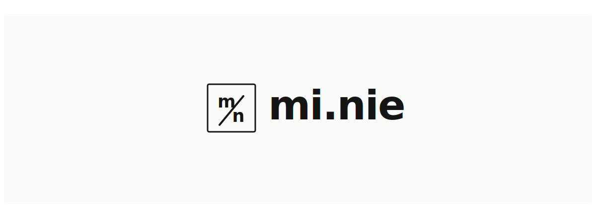

  

##### / stack

##### / listening

  

##### / selected work

- [PocketLedger](https://github.com/phumin89/PocketLedger) personal finance dashboard monorepo.
- [Render3d-tools](https://github.com/phumin89/Render3d-tools) automation helpers for 3D and render workflows.
